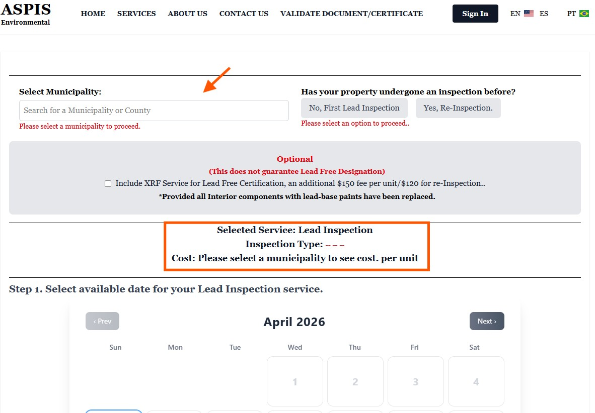
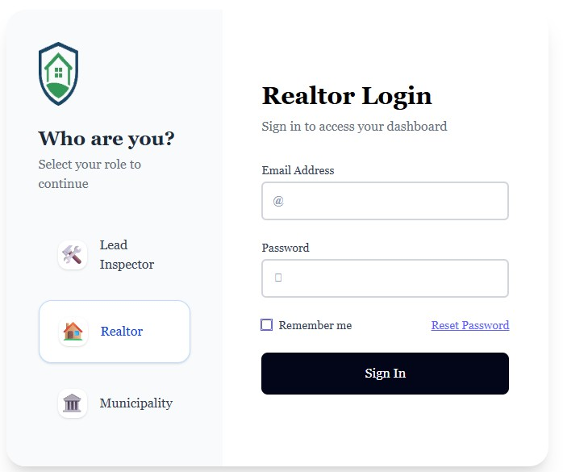

```{r setup, include=FALSE}
knitr::opts_chunk$set(echo = FALSE)
```

<style>
/* White background with black text for all slides */
body {
  background-color: #FFFFFF;
  color: #000000;
}

/* Title slide customization */
.title-slide {
  background-color: #FFFFFF !important;
  color: #000000 !important;
  text-align: left;
  padding: 80px 80px 40px 80px;
}

.title-slide h1 {
  font-size: 58px;
  color: #000000;
  margin-bottom: 20px;
}

.title-slide h2 {
  font-size: 28px;
  color: #222222;
}

.title-slide h3 {
  font-size: 22px;
  color: #444444;
}

/* Logo positioned on the right side of title slide */
.logo-right {
  position: absolute;
  top: 60px;
  right: 80px;
  width: 220px;   /* Adjust this value if you want the logo smaller or larger */
  height: auto;
  z-index: 100;
}

/* General slide styling */
.remark-slide-content {
  background-color: #FFFFFF;
  color: #000000;
  padding: 60px 80px;
}

h1, h2, h3 {
  color: #000000;
}

.remark-slide-number {
  color: #666666;
}
</style>


<div class="logo-right">
  
</div>


## Executive Summary

#### Why Aspis Environmental Should Be Your Preferred Vendor

Counties and cities face dual challenges: ensuring **lead-safe environments** while managing inefficient, fragmented inspection processes that slow down compliance, approvals, and public service delivery.

**Aspis Environmental** combines certified lead-based paint inspections (using Visual Inspection, Dust Wipe Sampling & advanced XRF technology) with a **modern, centralized Inspection Management Platform** designed specifically for **government, realtors, and residents.**

#### Our integrated solution delivers:
- Accurate, EPA/DCA/HUD-compliant lead inspections
- Real-time digital tracking, reporting, and verification
- Multi-lingual access (English, Spanish, Portuguese) for diverse communities
- Streamlined workflows that reduce administrative burden

Selecting Aspis as your **preferred vendor** gives you both reliable field services and a scalable digital ecosystem — resulting in **safer communities**, faster compliance, improved transparency, and significant operational efficiency.


---
## **Inspection Management Platform**

.pull-left[
#### County • Realtor • Client Unified System


**Modern Inspection Tracking, Reporting & Compliance System**
- Secure • Scalable • Multi-Lingual  
- Built for Counties, Realtors & Residents

 https://aspisenvironmental.com/
    
]

.pull-right[
### ASPIS Environmental Platform

         ]
         
---
## **Inspection Management Platform**

.pull-left[
#### County • Realtor • Client Unified System


**Modern Inspection Tracking, Reporting & Compliance System**
- Secure • Scalable • Multi-Lingual  
- Built for Counties, Realtors & Residents

 https://aspisenvironmental.com/
    
]
.pull-right[
#### Clean, secure authentication system built for scalability and ease of use.


         ]

---


.pull-left[
#### The Problem

**Inspection Systems Are Fragmented & Inefficient**
- Manual processes slow down approvals  
- Lack of centralized visibility  
- Language barriers limit accessibility  
- Poor tracking & verification systems  
- Difficult compliance and audit workflows
    ]

.pull-right[
#### The Solution

**A Centralized, Multi-Lingual Inspection Ecosystem**
- Real-time inspection tracking  
- Multi-user administrative system  
- Secure document validation  
- Multi-language access for diverse communities  
- Seamless booking, reporting & payments
         ]
         
---
.pull-left[
### Real Platform Interface
#### The Problem

**Role-Based Access Login**
**Separate access for:**
- Inspectors  
- Realtors  
- Municipalities / County Admins
    ]

.pull-right[
#### Clean, secure authentication system built for scalability and ease of use.


         ]
         
---

.pull-left[
### Real Platform Interface
#### The Problem

**Role-Based Access Login**
**Separate access for:**
- ~~Inspectors~~  
- ~~Realtors~~  
### - Municipalities / County Admins
    ]

.pull-right[
#### Municipalities / County Admins.


         ]

---
#### Admin Portal (County Access)

  <!-- Centered and large image -->


---

.pull-left[
#### Powerful Administrative Dashboard

- Statistical process control  
- Filter by City, Pass/Fail, Date range  
- Export data to CSV for compliance reporting
- Download or View all inspections in real-time  
    ]

.pull-right[
#### Statistical process control.


         ]

---

.pull-left[
#### Powerful Administrative Dashboard

- Statistical process control  
- Filter by City, Pass/Fail, Date range  
- Export data to CSV for compliance reporting
- Download or View all inspections in real-time  
    ]

.pull-right[
#### Filter by City.


         ]

---

.pull-left[
#### Powerful Administrative Dashboard

- Statistical process control  
- Filter by City, Pass/Fail, Date range  
- Export data to CSV for compliance reporting
- Download or View all inspections in real-time  
    ]

.pull-right[
#### Export data to CSV for compliance reporting.


         ]

---

.pull-left[
#### Powerful Administrative Dashboard

- Statistical process control  
- Filter by City, Pass/Fail, Date range  
- Export data to CSV for compliance reporting
- Download or View all inspections in real-time  
    ]

.pull-right[
#### Download or View all inspections in real-time.


         ]


---

.pull-left[
#### Multi-User & Role-Based Access
##### Built for Government Teams

- Unlimited admin users  
- Role-based permissions  
- Shared or departmental access

#### Inspection Tracking & Authenticity
- Secure, Verifiable Reports
 - Unique report ID for every inspection  
 -  Fully traceable system  
 -  Prevents fraud and duplication

#### Document Validation System
- Public & Secure Verification
 -  Users can validate reports online  
 -  Multi-lingual validation interface  
 -  Unique tracking numbers ensure authenticity

    ]

.pull-right[
#### Realtor Portal & Multi-Unit Owners.

- Built for Speed & TransactionsDedicated realtor accounts  
- Access to reports and tracking  
- Faster deal flow with verified inspections
         ]
         
---

.pull-left[
#### User Experience (Residents)
- Simple, Transparent & Accessible
 -  24/7 report access  
 -  Download reports anytime  
 -  Multi-lingual interface

#### Security & Privacy
- Data Protection First
 -  Unique report tracking system  
 -  Secure infrastructure  
 -  Built for compliance & trust
 
    ]

.pull-right[


         ]
---
#### User Experience (Residents)

.pull-left[
#### Booking & Scheduling
- Fast, Flexible Scheduling
 -  Book via Online portal • SMS • Phone • Email

#### Payments & Flexibility
- Multiple Payment Options
 -  Zelle • Check (No processing fee) 
 -  Stripe • Merchant processing (2 to 3% Processing fee)

#### Special Programs
- Community & Partner Benefits
 -  Discounts for county residents  
 -  Realtor partnership access  
 -  Scalable county-wide deployment

    ]

.pull-right[


         ]
---

### Pricing Model 
**Visual Inspection** $200  Per Inspection Fee (include state & County filing fee)

**Dust Wipe Sampling** $350  Per Inspection Fee (include state & County filing fee)

#### Realtor Plans

#### Reduce workload • Improve efficiency • Better serve multi-language communities

---

### Competitive Advantage
####Why ASPIS Wins
- Multi-lingual platform (rare in this space)  
- Built for government + real estate  
- Secure and audit-ready  
- Scalable across counties


### Built for Transparency. Designed for Scale.
Empowering counties, realtors, and residents with real-time, multilingual inspection intelligence.

---
.pull-left[

### Call to Action
## Let’s Partner Together

#### Next Steps:
- Schedule a live demo  
- Launch a pilot program  
- Customize for your county

 https://aspisenvironmental.com/
 
 (609) 433-6258
 
### Thank You

    ]

.pull-right[


         ]


