```{r setup, include=FALSE}
knitr::opts_chunk$set(echo = FALSE)
```

<style>
/* White background with black text for all slides */
body {
  background-color: #FFFFFF;
  color: #000000;
}

/* Title slide customization */
.title-slide {
  background-color: #FFFFFF !important;
  color: #000000 !important;
  text-align: left;
  padding: 80px 80px 40px 80px;
}

.title-slide h1 {
  font-size: 58px;
  color: #000000;
  margin-bottom: 20px;
}

.title-slide h2 {
  font-size: 28px;
  color: #222222;
}

.title-slide h3 {
  font-size: 22px;
  color: #444444;
}

/* Logo positioned on the right side of title slide */
.logo-right {
  position: absolute;
  top: 60px;
  right: 80px;
  width: 220px;   /* Adjust this value if you want the logo smaller or larger */
  height: auto;
  z-index: 100;
}

/* General slide styling */
.remark-slide-content {
  background-color: #FFFFFF;
  color: #000000;
  padding: 60px 80px;
}

h1, h2, h3 {
  color: #000000;
}

.remark-slide-number {
  color: #666666;
}
</style>


<div class="logo-right">
  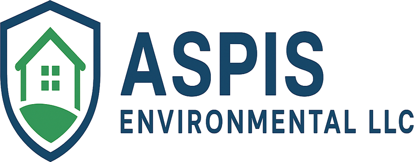
</div>


## Lead Based-Paint Inspection

#### THE REAL PROBLEM

**Counties Lack Visibility Into Inspections**

- No way to verify inspection reports
- No centralized tracking system
- Limited audit transparency
- Dependence on third-party claims

➡ Leads to:
- ❌ Compliance risk
- ❌ Legal exposure
- ❌ Lack of accountability
- ❌ LFraud

---
## **MARKET GAP**

.pull-left[
**What Other Providers Do**
- Perform inspections
- Issue reports
- No verification system
- No transparency after delivery
    
]

.pull-right[
**What Aspis Does**
- ✔ Tracks every inspection
- ✔ Verifies every report
- ✔ Provides real-time visibility
- ✔ Creates a permanent audit trail

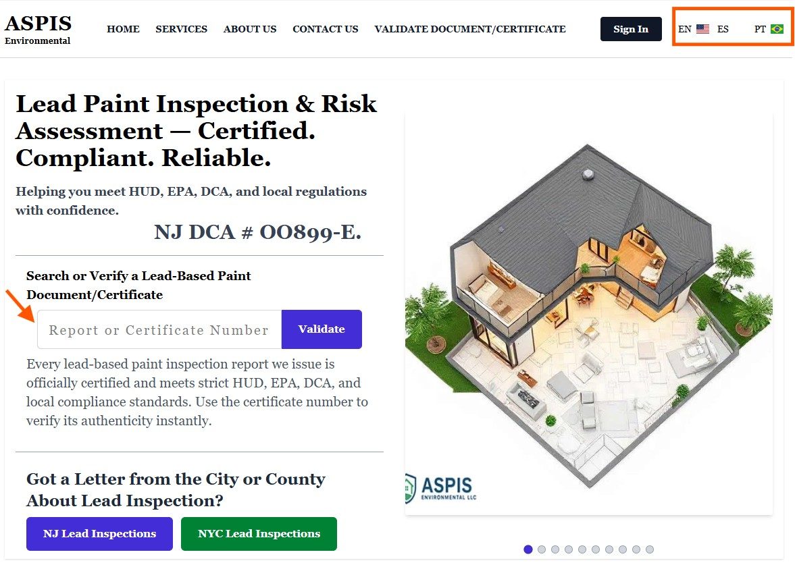
         ]
         
---
### **Aspis = Inspection + Verification + Transparency**

.pull-left[

**[3 Pillars]**

- 🧾 Inspection Execution
- 🔍 Report Verification
- 📊 Real-Time Tracking Dashboard

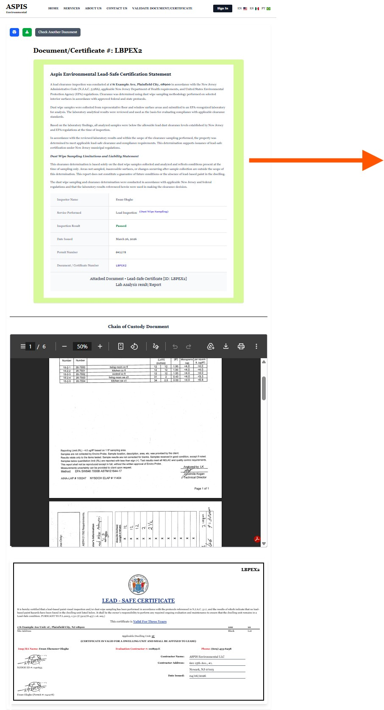
         
]
.pull-right[
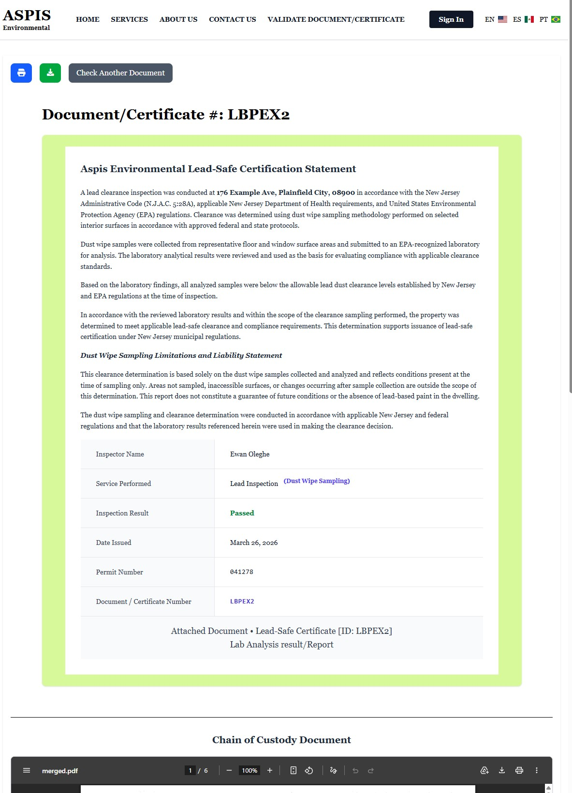
         ]
---
### **Aspis = Inspection + Verification + Transparency**

.pull-left[

**[3 Pillars]**

- 🧾 Inspection Execution
- 🔍 Report Verification
- 📊 Real-Time Tracking Dashboard

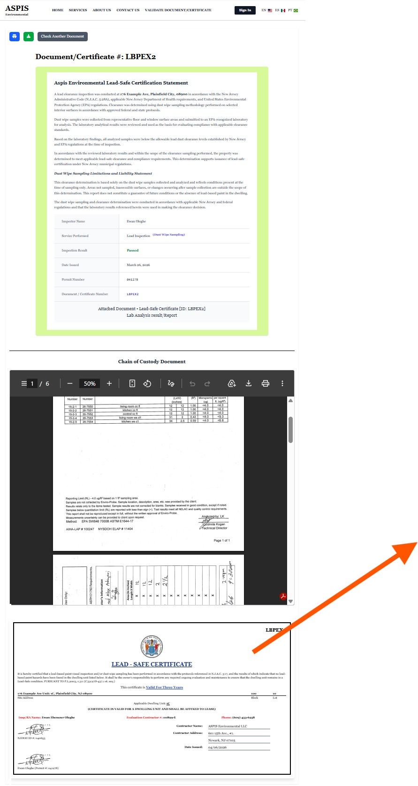
         
]
.pull-right[
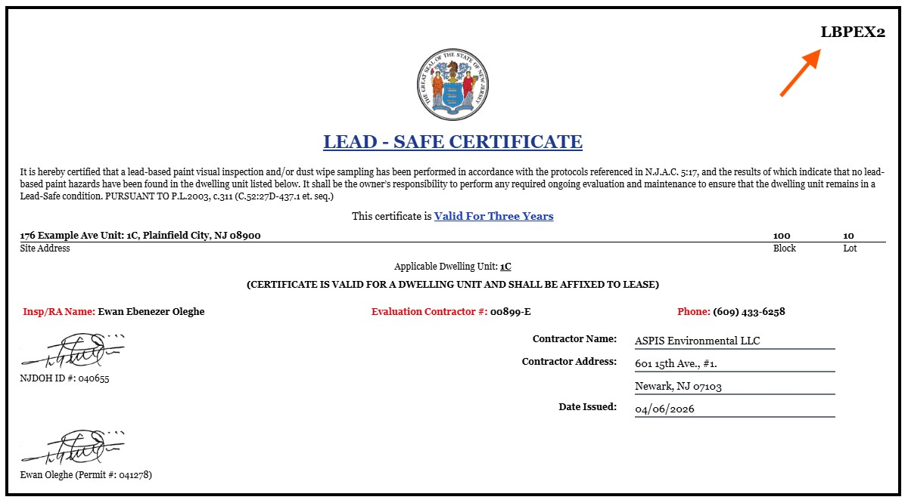
         ]

---

         
---
.pull-left[
### Secure Dedicated Access

**Role-Based Access Login**
**Separate access for:**
- ~~Inspectors~~  
- ~~Realtors~~  
### - Municipalities / County Admins
    ]

.pull-right[
#### Municipalities / County Admins.

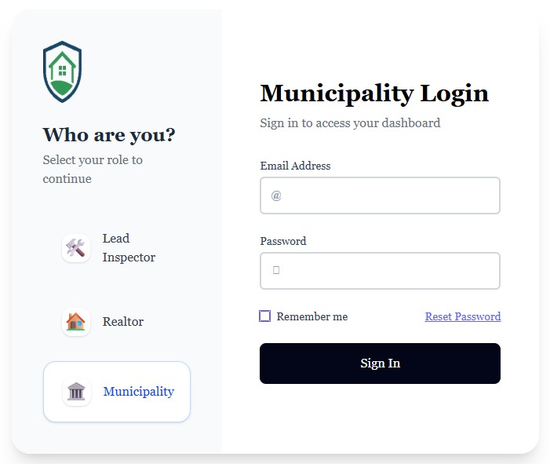
         ]

---
#### County Dashboard Access

  <!-- Centered and large image -->
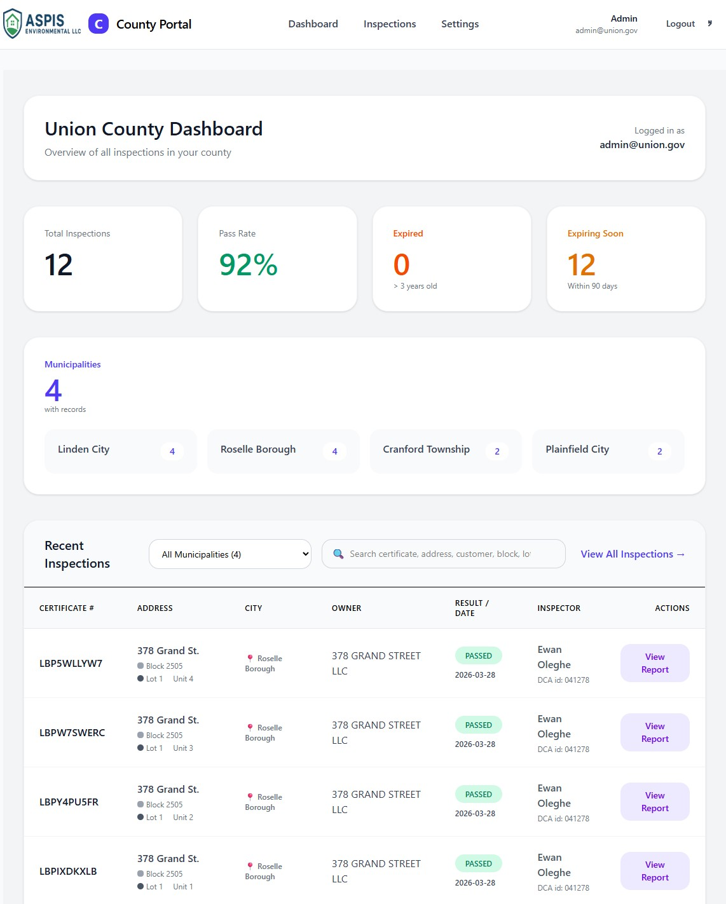

---

.pull-left[
#### Powerful Administrative Dashboard

- ✔ Real-time inspection tracking
- ✔ Report & certificate validation
- ✔ Statistical summaries
- ✔ Full audit visibility


- Statistical process control  
- Filter by City, Pass/Fail, Date range  
- Export data to CSV for compliance reporting
- Download or View all inspections in real-time  
    ]

.pull-right[
#### Statistical process control.

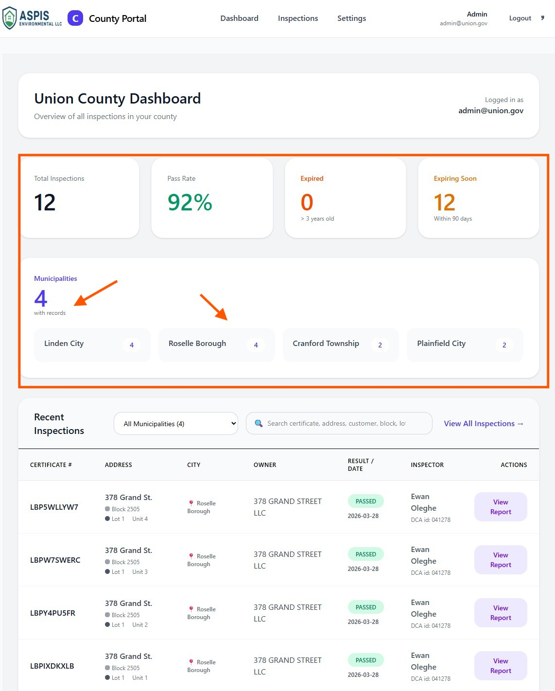
         ]

---

.pull-left[
#### Powerful Administrative Dashboard

- Statistical process control  
- Filter by City, Pass/Fail, Date range  
- Export data to CSV for compliance reporting
- Download or View all inspections in real-time  

**Dashboard Insights**

- Total inspections conducted
- Status (pending / completed / flagged)
- Validation status
- Trends & analytics
- Compliance indicators
    ]

.pull-right[
#### Filter by City.

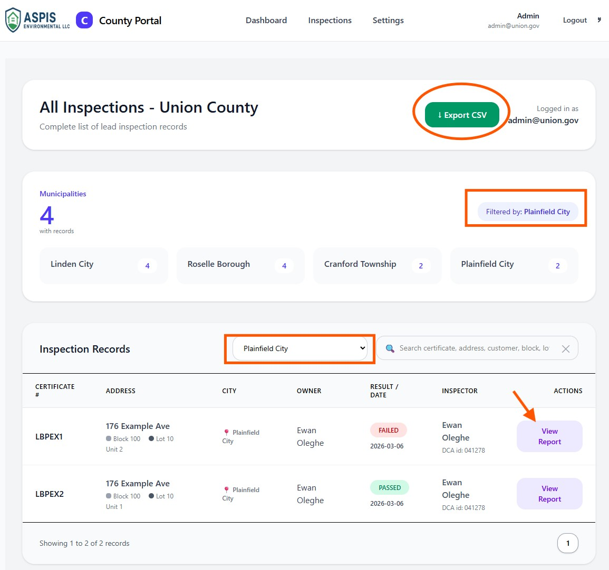
         ]

---

.pull-left[
#### Powerful Administrative Dashboard

- Statistical process control  
- Filter by City, Pass/Fail, Date range  
- Export data to CSV for compliance reporting
- Download or View all inspections in real-time  
    ]

.pull-right[
#### Export data to CSV for compliance reporting.

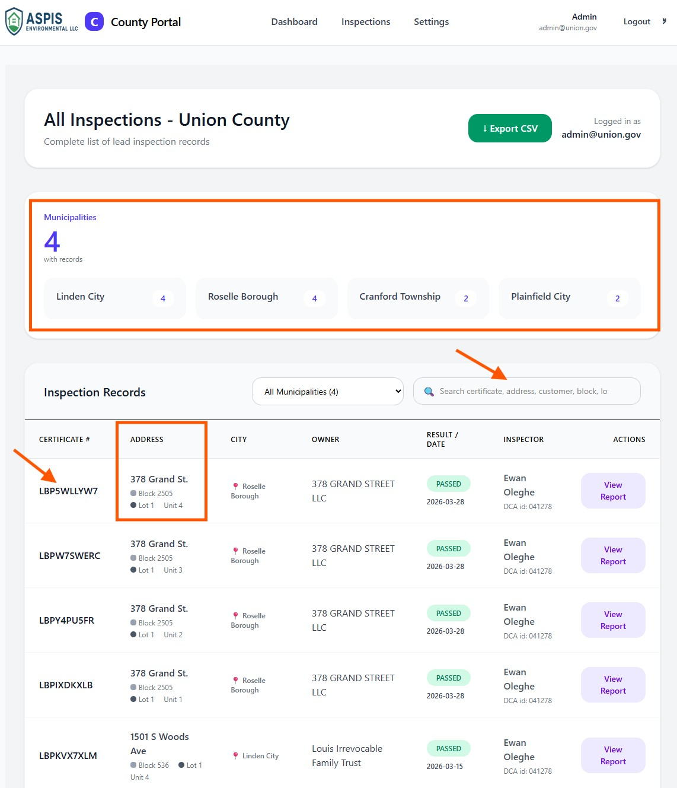
         ]

---

.pull-left[
#### Powerful Administrative Dashboard

- Statistical process control  
- Filter by City, Pass/Fail, Date range  
- Export data to CSV for compliance reporting
- Download or View all inspections in real-time  
    ]

.pull-right[
#### Download or View all inspections in real-time.

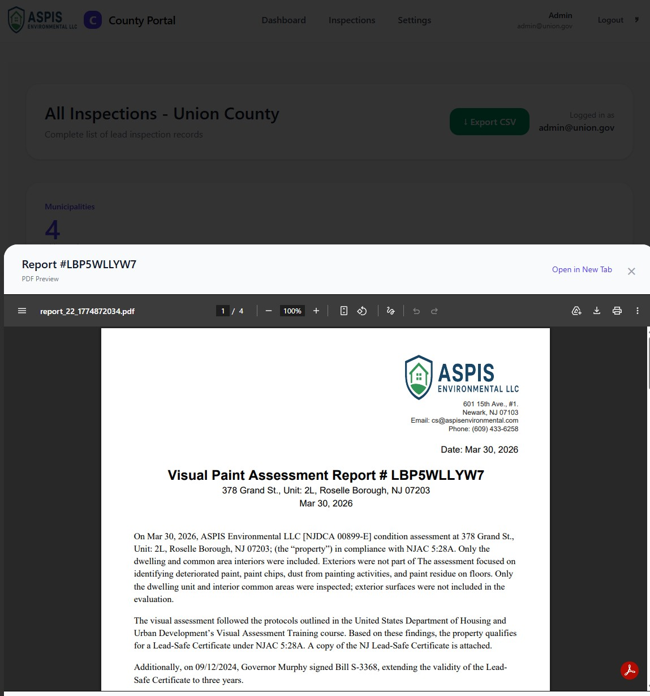
         ]


---

.pull-left[
#### Built for Accountability
##### Built for Government Teams
- ✔ Shared or departmental access
- ✔ Audit-ready data
- ✔ Transparent workflows

#### Inspection Tracking & Authenticity
- Secure, Verifiable Reports
 - Unique report ID for every inspection  
 -  Fully traceable system  
 -  Prevents fraud and duplication

#### Tamper-resistant & Validation System
- Public & Secure Verification
 -  Users can validate reports online  
 -  Multi-lingual validation interface  
 -  Unique tracking numbers ensure authenticity

    ]

.pull-right[
#### Connected Stakeholders

**County ←→ Aspis ←→ Realtors ←→ Residents**

- ✔ Shared visibility
- ✔ Verified information
- ✔ Unified tracking


#### Realtor Portal & Multi-Unit Owners.

- Built for Speed & TransactionsDedicated realtor accounts  
- Access to reports and tracking  
- Faster deal flow with verified inspections

         ]
         
---

.pull-left[
#### User Experience (Residents)
- Simple, Transparent & Accessible
 -  24/7 report access  
 -  Download reports anytime  
 -  Multi-lingual interface

#### Security & Privacy
- Data Protection First
 -  Unique report tracking system  
 -  Secure infrastructure  
 -  Built for compliance & trust
 
    ]

.pull-right[


         ]
---
#### User Experience (Residents)

.pull-left[
#### Booking & Scheduling
- Fast, Flexible Scheduling
 -  Book via Online portal • SMS • Phone • Email

#### Payments & Flexibility
- Multiple Payment Options
 -  Zelle • Check (No processing fee) 
 -  Stripe • Merchant processing (2 to 3% Processing fee)

#### Special Programs
- Community & Partner Benefits
 -  Discounts for county residents  
 -  Realtor partnership access  
 -  Scalable county-wide deployment

    ]

.pull-right[

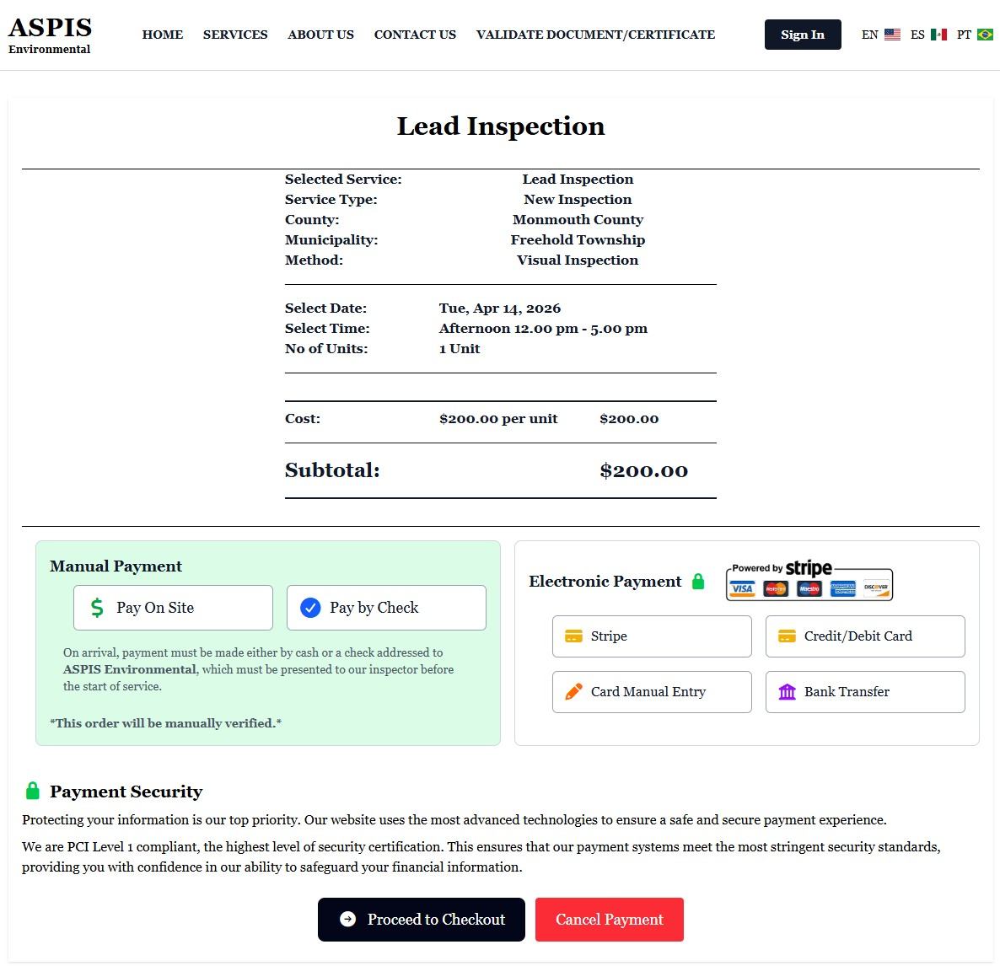
         ]
---
### COMPETITIVE EDGE

| Capability           | Others | ASPIS |
|---------------------|--------|-------|
| Inspection Service  | ✅     | ✅    |
| Report Verification | ❌     | ✅    |
| Tracking System     | ❌     | ✅    |
| County Dashboard    | ❌     | ✅    |
| Audit Transparency  | ❌     | ✅    |
| Public Health Education  | ❌     | ✅    |

---

.pull-left[
### COMPETITIVE EDGE

| Capability           | Others | ASPIS |
|---------------------|--------|-------|
| Inspection Service  | ✅     | ✅    |
| Report Verification | ❌     | ✅    |
| Tracking System     | ❌     | ✅    |
| County Dashboard    | ❌     | ✅    |
| Audit Transparency  | ❌     | ✅    |
| Public Health Education  | ❌     | ✅    |

  ]

.pull-right[
### What This Means for You

- ✔ Reduced liability
- ✔ Stronger compliance
- ✔ Better oversight
- ✔ Increased trust with residents
- ✔ Data-driven decision making
  ]
---

### Pricing Designed for Counties

**Per Inspection (includes state & county filing fees)**
 
- Visual Inspection: **$200**
- Dust Wipe Sampling: **$350**


#### Realtor Plans

#### Reduce workload • Improve efficiency • Better serve multi-language communities

---

### Aspis is the only inspection provider that gives counties real-time verification and full visibility into every inspection conducted.

### Built for Transparency. Designed for Scale.
Empowering counties, realtors, and residents with real-time, multilingual inspection intelligence.


---
.pull-left[

### Call to Action
## Let’s Partner Together

#### Next Steps:
- Schedule a live demo  
- Launch a pilot program  
- Customize for your county

 https://aspisenvironmental.com/
 
 (609) 433-6258
 
### Thank You

    ]

.pull-right[

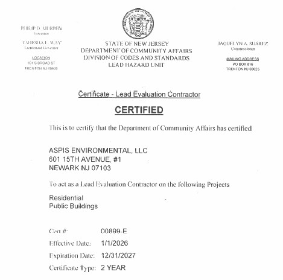
         ]


